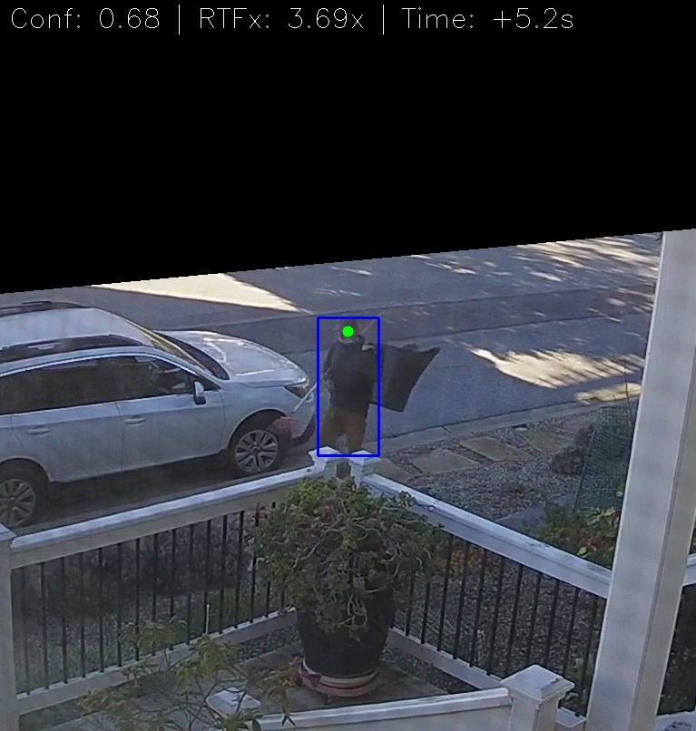

Beginning this week, I set out to build a "Person Watcher" for my security cameras. I thought the challenge would be selecting from the many YOLO model and
engine choices for object detection. I was wrong. The challenge became making everything (queueing, threading, video -> image region masking etc.) run in the
background of a Mac Mini i7 that was already busy doing a dozen other things.

Here are some key lessons I learnt while moving this script from a "heavy prototype" to a "production-ready service".

### 1. The OpenVINO engine

If you are running on Intel, skip using native `.pt` files. I benchmarked three engines:

1. **PyTorch (.pt):** ~1.65x RTFx (Real-time factor).
2. **ONNX:** Significant improvement and close to OpenVINO
3. **OpenVINO:** **2.94x RTFx.** By switching to OpenVINO, I didn't just get faster alerts; I gave the Intel CPU "breathing room" to stay cool. The script now processes video ~3x faster than it is recorded.

### 2. Guarding the thermals (4-thread limit)

A 6-core i7 will happily try to use all 12 threads for a matrix multiplication, hitting thermal limits in seconds. To prevent this Mac Mini from thermal
throttling, and slowing *everything else* down, I had to enforce strict thread limits at the OS and Engine level:

* `OMP_NUM_THREADS=4`.
* `intra_op_num_threads = 4` inside the YOLO predictor.
* launchd plist: specify `background` process and set the `nice` value.

This kept the fans quiet and the other apps on the machine snappy.

### 3. You only get what you measure

Initial testing often showed great speeds per frame, but those numbers lied. They didn't account for the overhead of loading files, initializing the engine
and environment for sustained performance, or the gaps between frames.  I implemented a proper **realtime-factor (RTFx) calculation** to get a "True Average"
that reflected the actual performance.

### 4. The engineering "gotchas"

* **Masking:** Don't just mask the image; mask the *logic*. Checking the center of a person's head against a binary mask array is computationally "free" compared to running inference on a cropped region that the engine is not optimized to compute.
* **Stability:** Never trust a file just because it appeared in a folder. I had to implement a `wait_for_file_stable` loop to ensure the camera had finished writing the `.mp4` before trying to open the stream.

### 5.  Pick your assistant carefully

Initially I started with OpenAI ChatGPT (v5.2) web GUI1 as programming coach and buddy.  Eventually it got stuck trying to help with optimization
and the performance got steadily worse (RTFx < 1.0 or non real-time!).  It could not help me debug using the ONNX engine.  So I switched to Google Gemini
web GUI and the pace and results picked up dramatically.  Next project I will start with Google Gemini.

### **Conclusion:**

You definitely don't need an NVIDIA GPU to do great computer vision. You just need to be intentional about your pipeline. By focusing on thread management,
engine optimization, image processing and robust error handling, I turned an "AI experiment" into a reliable piece of home infrastructure that uses
artificial intelligence to sift through heaps of captured video.  Happy New Year all!

1. For this project I wanted to avoid using an IDE assistant like Cursor or VS Studio's Copilot. e.g.: avoid inline automated inline code changes.  Instead I wanted to take more hands-on approach flipping between the manual code entry in the IDE and the assistant's web page.  I think this is a good working approach for heavy optimization work like this.
